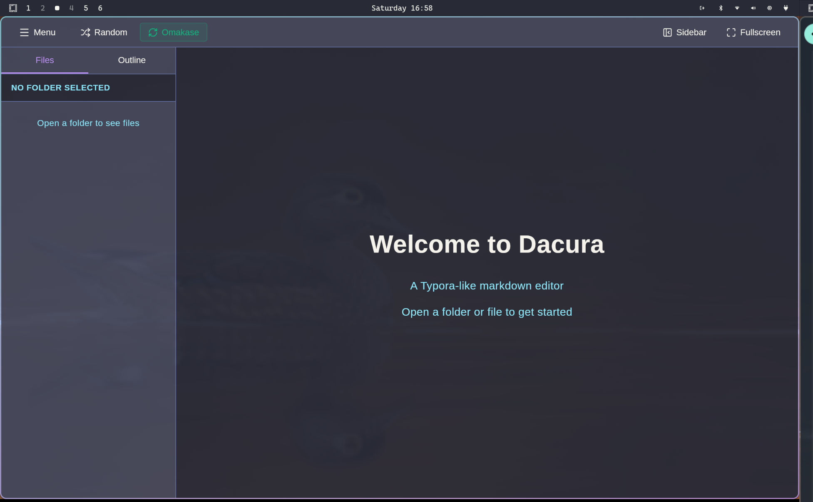
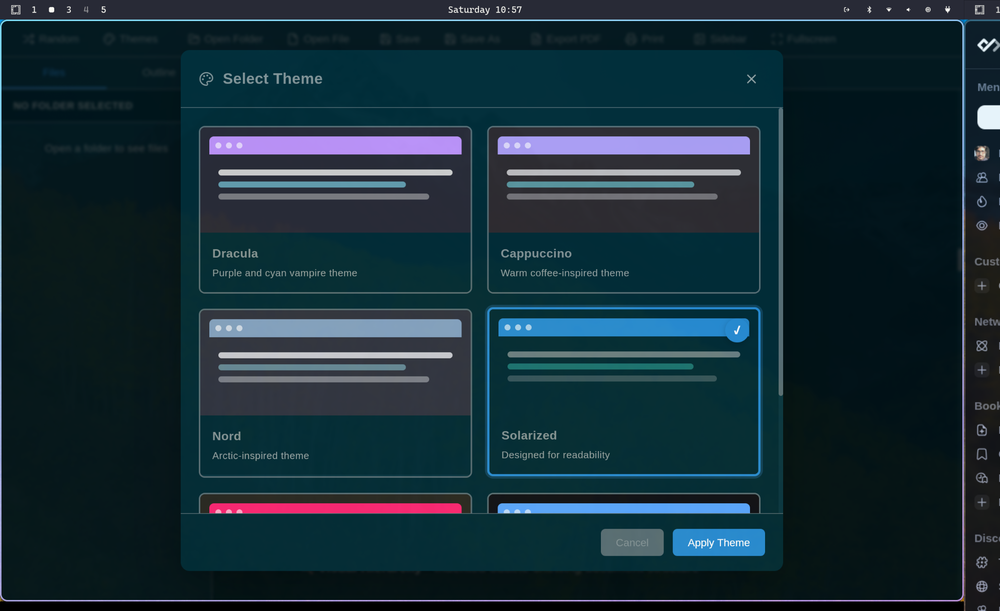
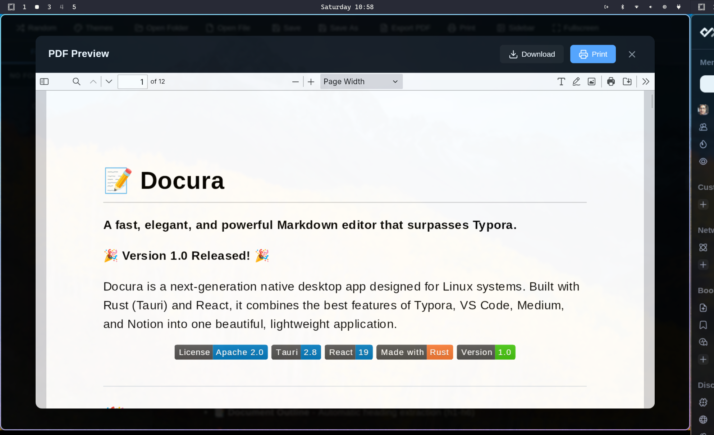
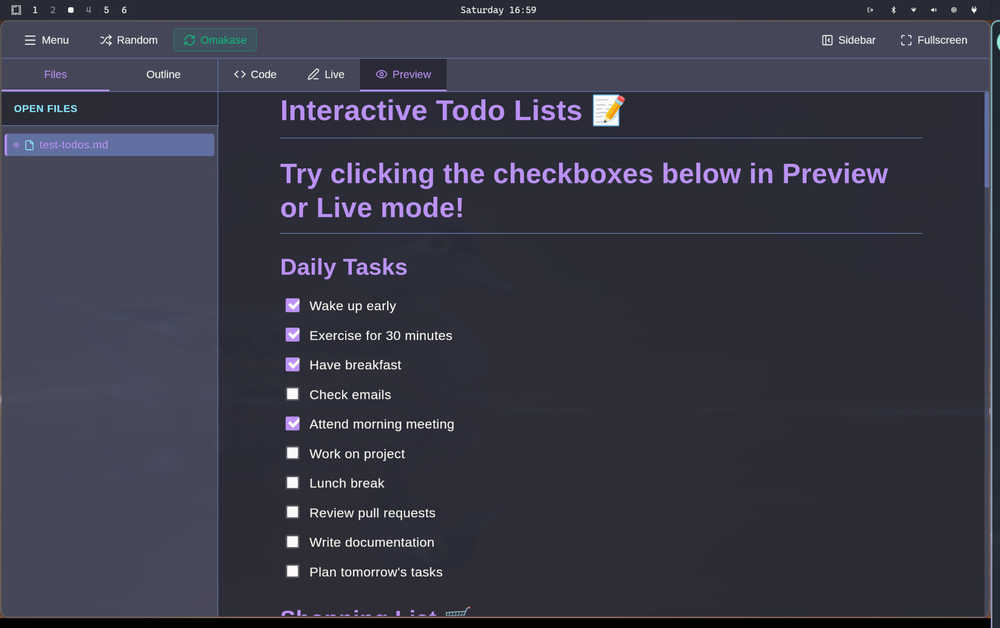

# 📝 Docura

**From Markdown Editor to Writing Operating System**

🚀 A fast, elegant, and powerful next-generation writing platform that surpasses Typora and transforms how you create content.

🎉 **Version 1.1 Released!** 🎉

Docura is not just another markdown editor - it's the foundation for the **ultimate writing environment**. Currently a powerful native desktop app designed for Linux systems, built with Rust (Tauri) and React, combining the best features of Typora, VS Code, Medium, and Notion into one beautiful, lightweight application.


**Coming Soon:** AI assistance, real-time collaboration, advanced publishing, and intelligent writing analytics. [See our future vision →](#-future-vision---v20-and-beyond)

## 🎉 **DHH APPROVED!** - Omarchy Integration

> **"Very nice! Love the active Omarchy sync integration 👌"**  
> — DHH (David Heinemeier Hansson), Creator of Ruby on Rails & Omarchy

**Docura now syncs seamlessly with [Omarchy](https://omakub.org) - and DHH loves it!**

Respect the setup. When Omarchy controls your theme, Docura respects that choice - just like DHH intended. No overrides, no fighting the system. It just works. ✨

**✅ Exact theme matching for all 12 Omarchy themes!**

[Learn more about Omarchy Integration →](#-omarchy-integration)

<div align="center">

[](LICENSE)
[](https://tauri.app)
[](https://reactjs.org)
[](https://www.rust-lang.org/)
[](https://github.com/WOF-Softwares/Docura/releases)

</div>

---

## 🎉 What's New in v1.1 (Day 2!)

**Day 2 brings a MASSIVE feature update!** Docura keeps getting better:

### 🆕 Day 3 Features (October 12, 2025)
- **🚀 Comprehensive Export System**: Now supports 8+ export formats in a beautiful submenu!
  - **PDF Export** (with Ctrl+E shortcut)
  - **HTML Export** (Standard, Plain, Tailwind CSS, Bootstrap)
  - **JSON Export** (with metadata and timestamps)
  - **RTF Export** (for word processors)
  - **MediaWiki Export** (ready for Wikipedia!)
- **📁 Export Submenu**: Clean, organized interface like the Recent menu
- **🔧 Extensible Architecture**: Easy to add new export formats
- **🎯 Smart File Dialogs**: Appropriate file extensions and filters
- **⚡ Error Handling**: Comprehensive validation and user feedback

### 🆕 Day 2 Features (October 11, 2025)
- 🏠 **Modern Welcome Screen** - VSCode/Cursor-style welcome with time-based greetings, quick actions, recent items, keyboard shortcuts! **Typora doesn't have this!** ✨
- 📱 **Ultra-Responsive Design** - Welcome screen adapts perfectly to any screen size, high DPI displays, Wayland scaling, and tiling WMs!
- 🎨 **Omarchy Integration** - Auto-sync with DHH's Omarchy themes! Respects Omarchy control when enabled
- ⚙️ **Settings Dialog** - New settings page for Omarchy sync and future preferences
- 📋 **Menu System** - Professional unified menu (File, Export, View, Settings)
- 🔍 **Quick Search (Ctrl+P)** - VSCode-style command palette to instantly find files in folder and recent items
- 📜 **Recent History** - Track last 15 opened files/folders, stored in ~/.local/share/docura/config.json
- 📂 **Recent Submenu** - Hover-activated submenu in menu for quick access to recent items
- ✨ **Keyboard Shortcuts** - Ctrl+S (Save), Ctrl+P (Quick Search), Ctrl+O (Open), Ctrl+N (New), and more
- 🔔 **Toast Notifications** - Beautiful feedback for every action (save, open, errors)
- 🔴 **Unsaved Changes Indicator** - Pulsing dot shows when file needs saving
- 🎯 **Active File Highlighting** - Current file highlighted in sidebar with accent border
- 📁 **Single File Support** - Open files without folder now appear in sidebar
- 🖼️ **Image Loading** - Display local images in markdown with automatic path conversion
- ✅ **Interactive Checkboxes** - Click to toggle task lists in Preview/Live modes
- 🎨 **Theme-Aware Checkboxes** - Checkboxes match your current theme
- 📄 **New File Command** - Create new files with Ctrl+N, prompts to save unsaved changes
- 🧠 **Smart Filename Preview** - Live filename suggestion from H1 header or first line
- 💻 **CLI Arguments** - Open files/folders from terminal: `docura .`, `docura file.md`
- 🪟 **Multi-Window Support** - Open multiple Docura instances, like VS Code or Chrome!
- 📁 **Smart Folder Dialog** - Choose to open in new window or replace current folder
- 🎯 **Clean State Management** - Seamless transitions between folders, files, and new documents
- 🖱️ **Context Menu** - Right-click menu with common actions (New, Open, Copy, Paste, etc.)
- 💾 **Auto-Save** - Smart auto-save that saves 2 seconds after you stop typing (toggle in Settings)
- 📸 **Image Paste** - Paste images directly from clipboard, automatically saves to assets folder

### 📦 v1.0 Core Features
- ✅ **Three Editing Modes** - Code, Live (WYSIWYG), and Preview
- ✅ **17 Beautiful Themes** - Unified across entire application (12 classic + 5 Omarchy-exact)
- ✅ **PDF Export** - High-quality PDF generation with native save dialogs
- ✅ **Print Support** - PDF preview dialog with system print integration
- ✅ **Fullscreen Mode** - Distraction-free writing (F11)
- ✅ **Tiling WM Support** - Auto-detection for i3, sway, Hyprland, etc.
- ✅ **Document Outline** - Clickable navigation with smooth scrolling
- ✅ **96% Less Disk Space** - 12 MB vs Typora's 326 MB!
- ✅ **23% Less RAM** - 780 MB vs Typora's 1011 MB
- ✅ **94% Smaller Download** - 5 MB package vs 80 MB
- ✅ **100% Open Source** - Apache 2.0 license

**Getting better every day!** 🚀

### 🕰️ Docura's Evolution Timeline

**Built in less than 2 days, with continuous improvements!**

| Milestone | Time | Duration |
|-----------|------|----------|
| 🚀 **Started** | October 9, 10:12 PM | Day 0 |
| ⚙️ **Core features built** | Overnight | ~12 hours |
| 🎨 **Themes, toolbar, live preview** | October 10 | Day 1 |
| 📂 **File access, outline linking** | October 10, late | Day 1 |
| 🖨️ **Export, print, native dialogs** | October 11, morning | Day 2 |
| ✅ **v1.0 Released** | October 11, 11:29 AM | **37 hours!** |
| 🎉 **Day 2 Features** | October 11, evening | Day 2 |
| ⌨️ **Keyboard shortcuts, toasts** | October 11 | Day 2 |
| 🖼️ **Image loading, checkboxes** | October 11 | Day 2 |
| 🎯 **File indicators, highlights** | October 11 | Day 2 |
| 💻 **CLI args, multi-window** | October 11, late evening | Day 2 |
| 🧠 **Smart filename preview** | October 11, late evening | Day 2 |

**From zero to feature-rich in 2 days!** ⚡
**17 major features on Day 2 alone!** 🎉
*That's the power of Rust + Tauri + React + Amazing AI Tools!*

---

## 💻 CLI Usage

**Open files and folders directly from your terminal!**

```bash
# Open current directory
$ docura .

# Open specific file
$ docura readme.md
$ docura ~/Documents/notes.md

# Open specific folder
$ docura ~/Projects/MyApp

# Multiple instances
$ docura ~/project1 &
$ docura ~/project2 &
$ docura ~/project3 &
```

**Professional workflow, just like VS Code!** 🚀

---

## 🪟 Multi-Window Support

**Work on multiple projects simultaneously - YOUR choice!**

When you try to open a second folder, Docura **asks what YOU want** (unlike Typora which forces multiple windows):

```
📁 Open New Folder?

You already have "ProjectA" open.
How would you like to proceed?

[🖥️  Open in New Window]  ← Keep both open!
[🔄 Replace This Folder]   ← Switch folders
[Cancel]
```

**Why this matters:**
- ✅ **Typora:** Silently creates multiple windows (no choice!)
- ✅ **Docura:** Respects YOUR preference (you decide!)
- ✅ **Result:** Better UX through user control! 🎯

**Technical Excellence:**
- Multi-window support with Tauri's strict security model (harder than Electron!)
- Each window respects tiling WM settings automatically
- Full file operations in every window
- Proper permissions architecture

**Like Chrome, VS Code, and Sublime - but LIGHTER and more RESPECTFUL!** 💪

### **Why Docura Can Be Better:**

**The Advantage of AI-Assisted Solo Development:**
- 🚀 **Docura:** 1 developer + Claude AI = Rapid innovation, instant user feedback implementation
- 🐌 **Typora:** Team + meetings + bureaucracy = Slow decisions, can't fix simple UX issues
- ⚡ **Result:** User requests "please ask before opening window" → Fixed in 30 minutes!
- 📊 **Traditional Team:** Same request → Needs: Product meeting, design review, sprint planning, QA cycle... 6 months maybe?

**2025 Reality:** AI-assisted solo developers can move FASTER and be MORE user-centric than traditional teams! 💪

---

## 🎨 Omarchy Integration

**Docura respects DHH's Omarchy philosophy!**

[Omarchy](https://omakub.org) is DHH's (creator of Ruby on Rails) curated development environment for Arch Linux. Docura now integrates seamlessly with it!

### ✨ Features

- **🔍 Auto-Detection** - Automatically detects Omarchy environment
- **🔄 Theme Sync** - Syncs with your Omarchy theme every 30 seconds
- **🎨 12 Theme Mappings** - Dracula, Catppuccin, Nord, Gruvbox, Tokyo Night, and more!
- **🔒 Respects Control** - When synced, Omarchy is in control (no manual overrides!)
- **⚙️ Settings Integration** - Easy toggle in Settings dialog
- **💚 Zero Configuration** - Just enable sync and it works!

### 🎯 The Philosophy

When you enable Omarchy sync, **Docura respects that choice**:
- ❌ Manual theme changes are blocked
- ⚠️ Clear warnings if you try to change themes
- ✅ Must disable sync in Settings to regain manual control

**This is intentional!** Just like DHH's opinionated approach to Rails and Omarchy - when you choose a system, you trust it. No half-measures.

### 🚀 How to Use

1. **Install Omarchy** on your Arch Linux system
2. **Open Docura** → It auto-detects Omarchy!
3. **Menu → Settings** → Enable "Auto-sync with Omarchy theme"
4. **Done!** Docura now follows your Omarchy theme

Change your theme in the terminal → Docura updates automatically! ✨

### 🗺️ Supported Themes - Exact Matches! 🎯

**After DHH's feedback, we added EXACT theme implementations!**

| Omarchy Theme | Docura Theme | Status |
|---------------|--------------|--------|
| Dracula | Dracula Dark | ✅ Exact match |
| Catppuccin | Cappuccino Dark | ✅ Exact match |
| Catppuccin Latte | Cappuccino Light | ✅ Exact match |
| Nord | Nord Dark | ✅ Exact match |
| **Gruvbox** | **Gruvbox Dark** | 🆕 **NEW! Exact colors!** |
| **Tokyo Night** | **Tokyo Night** | 🆕 **NEW! Exact colors!** |
| **Everforest** | **Everforest Dark** | 🆕 **NEW! Exact colors!** |
| **Kanagawa** | **Kanagawa** | 🆕 **NEW! Exact colors!** |
| **Rose Pine** | **Rose Pine** | 🆕 **NEW! Exact colors!** |
| Ristretto | Cappuccino Dark | ✅ Similar aesthetic |
| Matte Black | GitHub Dark | ✅ Similar aesthetic |
| Osaka Jade | Nord Light | ✅ Similar aesthetic |

**5 brand new themes added to perfectly match Omarchy!** 🎨

### 📖 Documentation

- [Full Omarchy Integration Guide →](docs/OMAKASE_INTEGRATION.md)
- [Feature Summary →](OMAKASE_FEATURE_SUMMARY.md)

### 💬 Thank You, DHH! 🙏

> **"Very nice! Love the active Omarchy sync integration 👌"** — DHH

Your feedback inspired us to add **5 exact Omarchy theme implementations** (Tokyo Night, Everforest, Gruvbox, Rose Pine, Kanagawa) instead of approximations!

Built with respect for your work on Rails, Basecamp, and Omarchy. This integration follows your philosophy: **opinionated, simple, it just works**. When you choose Omarchy, Docura respects that completely. 🙏

---

## 📸 Screenshots

<div align="center">

### Three Editing Modes

*Code, Live (WYSIWYG), and Preview modes in one powerful editor*

### 17 Beautiful Themes (NEW: 5 Omarchy-Exact!)

*Unified theming across UI, editor, and preview - Now with DHH-approved Omarchy themes!*

### Document Outline Navigation

*Clickable headings with smooth scrolling*

### Comprehensive Export System

*Native save dialogs and print preview*

**🌐 [View Live Demo →](https://wof-softwares.github.io/Docura/)**

</div>

---

## 🌟 Why Docura is Better Than Typora

| Feature | Typora | Docura | Winner |
|---------|--------|--------|--------|
| **Editing Modes** | 1 (Inline only) | 3 (Code + Live + Preview) | 🏆 **Docura** |
| **Live Editor Options** | ❌ No choice | ✅ Classic (Split-pane) + Modern (Typora-like) | 🏆 **Docura** |
| **Code Editor** | Basic | Monaco (VSCode-level) | 🏆 **Docura** |
| **WYSIWYG Quality** | Good | Excellent (Vditor + MDEditor) | 🏆 **Docura** |
| **User Choice** | ❌ Forced workflow | ✅ Choose your editing style | 🏆 **Docura** |
| **Learning Curve** | Steep | Gentle - Multiple learning paths | 🏆 **Docura** |
| **Best for Beginners** | ❌ Confusing | ✅ Multiple approaches | 🏆 **Docura** |
| **Best for Pros** | ✅ Good | ✅ Better (more options) | 🏆 **Docura** |
| **Themes** | 6 | 17 (12 + 5 Omarchy themes) | 🏆 **Docura** |
| **Theme Consistency** | Partial | Full (UI + Editor + Preview) | 🏆 **Docura** |
| **Interactive Checkboxes** | ✅ Yes | ✅ Yes + Better UX | 🏆 **Docura** |
| **Outline Navigation** | ✅ Yes | ✅ Yes + Smooth scrolling | 🏆 **Docura** |
| **Tiling WM Support** | ❌ No | ✅ Auto-detection & titlebar hide | 🏆 **Docura** |
| **Disk Space** | ~326 MB | ~12 MB (96% less!) | 🏆 **Docura** |
| **Memory Usage** | ~1011 MB | ~780 MB (23% less!) | 🏆 **Docura** |
| **Open Source** | ❌ No | ✅ Yes (Apache 2.0) | 🏆 **Docura** |
| **Price** | $14.99 | 🆓 Free | 🏆 **Docura** |

### 🎯 The Docura Revolution

**Three Editing Modes + Two Live Editor Styles = Ultimate Flexibility:**

1. **Code Mode** 📝
   - Professional Monaco editor (same as VSCode)
   - Full syntax highlighting with 12 custom themes
   - Advanced features: IntelliSense, minimap, smooth scrolling
   - Perfect for markdown purists and developers

2. **Live Mode** ✍️ (Choose Your Style!)
   - **🎨 Modern (Vditor)** - Pure Typora-like WYSIWYG experience
     - True WYSIWYG editing with instant rendering
     - Clean, distraction-free interface
     - Perfect for writers who want seamless flow
   - **📱 Classic (MDEditor)** - Dual-pane split view
     - Side-by-side source and preview
     - Toolbar with formatting buttons
     - Educational - see markdown + rendered simultaneously
   - **⚙️ User Choice** - Switch anytime in Settings → Editor Settings!

3. **Preview Mode** 👁️
   - Beautiful read-only rendered markdown
   - Typora-inspired typography and layout
   - Clickable outline navigation with smooth scrolling
   - Perfect for reading and presenting

### 🚀 Why This Approach is Revolutionary

**From FocusWriter → Typora → Docura Evolution:**
- **FocusWriter**: Distraction-free but limited
- **Typora**: Great WYSIWYG but one-size-fits-all
- **🏆 Docura**: Best of all worlds with USER CHOICE!

**The Flexibility Advantage:**
- **Writers**: Use Modern mode for pure WYSIWYG flow
- **Developers**: Use Code mode for precise control
- **Learners**: Use Classic mode to see source + preview
- **Readers**: Use Preview mode for consumption
- **Everyone**: Switch modes based on your current task!

**No other editor gives you this level of choice and quality!**

---

## ✨ Features

### 📝 Editing & Rendering
- 🎨 **Three Editing Modes** - Code, Live (WYSIWYG), and Preview
- 💻 **Monaco Editor** - The same editor as VS Code with full features
- ✍️ **WYSIWYG Editor** - Split-pane markdown editing with live preview
- 👁️ **Beautiful Preview** - Typora-inspired typography and layout
- ✅ **Interactive Checkboxes** - Click to toggle task lists in Preview/Live modes
- 🖼️ **Image Support** - Display local images with automatic path conversion
- 🔒 **Secure Image Loading** - Tauri asset protocol for safe file access
- 🎯 **Syntax Highlighting** - For code blocks in 12 custom themes

### 🎨 Theming System
- 🌈 **17 Beautiful Themes** - 12 classic themes + 5 Omarchy-exact themes
  - **Classic Themes:** Dracula, Cappuccino, Nord, Solarized, Monokai, GitHub (light/dark variants)
  - **🎉 NEW Omarchy Themes:** Tokyo Night, Everforest, Gruvbox, Rose Pine, Kanagawa
- 🎭 **Unified Theming** - Consistent colors across UI, Editor, and Preview
- 👌 **DHH Approved** - Exact Omarchy theme matching
- 💾 **Theme Persistence** - Your choice is saved between sessions
- 🎲 **Random Theme** - Discover new themes with one click

### 📂 File Management & Navigation
- 📁 **Folder Explorer** - Recursive directory tree with expand/collapse
- 📄 **Multiple File Support** - Quick switching between markdown files
- 🔍 **Quick Search (Ctrl+P)** - Instantly find files VSCode-style
  - Real-time fuzzy search across all files in folder
  - Searches through recent items history
  - Keyboard navigation (↑↓ arrows, Enter to open, Esc to close)
  - Shows up to 15 results with smart sorting
  - Markdown files only (filters out images, configs, etc.)
- 📜 **Recent History** - Automatically tracks last 15 files/folders
  - Stored in `~/.local/share/docura/config.json`
  - Accessible via hover submenu in Menu
  - Quick re-open frequently used files
  - Clear history option
- 💾 **Save & Save As** - Standard file operations with native dialogs
- 🔔 **Toast Notifications** - Visual feedback for all file operations
- 🔴 **Unsaved Changes** - Pulsing dot indicator when file needs saving
- 🎯 **Active File Highlight** - Current file highlighted with accent border
- 📋 **Single File Mode** - Files opened without folder show in sidebar
- 🔄 **Auto-sync** - Changes reflect across all editor modes
- 💾 **Auto-Save** - Smart auto-save 2 seconds after typing stops (toggle in Settings)
- 📸 **Image Paste** - Paste images from clipboard, saves to assets/ folder automatically

### 📄 Export & Print
- 🚀 **Comprehensive Export System** - 8+ formats in beautiful submenu interface
  - 📑 **PDF Export** - Beautiful PDFs with theme styling (Ctrl+E)
  - 🌐 **HTML Exports** - Standard, Plain, Tailwind CSS, Bootstrap variants
  - 📊 **JSON Export** - Structured data with metadata and timestamps
  - 📝 **RTF Export** - Rich Text Format for word processors
  - 📖 **MediaWiki Export** - Ready for Wikipedia and wiki platforms
- 🖨️ **Print Support** - PDF preview dialog with print and download options
- 🎯 **Smart File Dialogs** - Appropriate extensions and filters per format
- 🔧 **Extensible Architecture** - Easy to add new export formats
- 💾 **Native Dialogs** - System-native file save dialogs for seamless UX
- ⚡ **Error Handling** - Comprehensive validation and user feedback

### 🗺️ Navigation
- 📑 **Document Outline** - Automatic heading extraction (h1-h6)
- 🎯 **Click to Navigate** - Jump to any section with smooth scrolling
- 👁️ **Auto-Preview Switch** - Clicking outline switches to preview mode
- 🔍 **Visual Hierarchy** - Indented outline showing document structure

### 🪟 Window Management
- 🖥️ **Tiling WM Detection** - Auto-detects i3, sway, Hyprland, bspwm, etc.
- 🎬 **Fullscreen Mode** (F11) - Distraction-free writing
- 📐 **Sidebar Toggle** (Ctrl+B) - Show/hide file explorer
- 🎯 **Smart UI** - Hides toolbar and sidebar in fullscreen

### ⌨️ Keyboard Shortcuts
- **Ctrl+P** - Quick Search (find files instantly)
- **Ctrl+S** - Save current file
- **Ctrl+Shift+S** - Save As (with dialog)
- **Ctrl+O** - Open file
- **Ctrl+Shift+O** - Open folder
- **Ctrl+N** - New file
- **Ctrl+E** - Export to PDF
- **Ctrl+Alt+P** - Print (preview dialog)
- **Ctrl+Shift+P** - Settings
- **Ctrl+B** - Toggle sidebar visibility
- **F11** - Toggle fullscreen mode

*VSCode-level keyboard shortcuts!* ⚡

### 🚀 Performance
- ⚡ **23% Less Memory** than Typora (780 MB vs 1011 MB)
- 🦀 **Rust Backend** - Native performance and safety
- 🌐 **System WebKit** - No bundled Chromium
- 📦 **Small Binary** - Efficient resource usage

### 🔒 Privacy & Security
- 🔐 **Offline-first** - All data stays on your machine
- 🚫 **No Telemetry** - Zero tracking or data collection
- 📍 **Local Storage** - Files never leave your computer
- 🔓 **Open Source** - Audit the code yourself

---

## 🧱 Tech Stack

| Layer       | Technology |
|-------------|------------|
| **Backend** | [Tauri 2.8](https://tauri.app) - Rust-based desktop framework |
| **Frontend** | React 19 + Vite 7 |
| **Code Editor** | [Monaco Editor](https://microsoft.github.io/monaco-editor/) (VS Code's editor) |
| **WYSIWYG Editor** | [@uiw/react-md-editor](https://github.com/uiwjs/react-md-editor) |
| **Markdown** | [react-markdown](https://github.com/remarkjs/react-markdown) with [remark-gfm](https://github.com/remarkjs/remark-gfm) |
| **Syntax Highlighting** | [Prism](https://prismjs.com/) via react-syntax-highlighter |
| **File I/O** | Tauri plugins (fs, dialog) |
| **Renderer** | WebKitGTK (system native) |
| **Styling** | Custom CSS with CSS variables + modern-normalize |

---

## 📊 Performance Comparison

Tested on Linux (Arch) with both applications:

| Metric | Typora (Electron) | Docura (Tauri) | Savings |
|--------|-------------------|----------------|---------|
| **Disk Space** | 326 MB | 12 MB | **-314 MB (96%)** ⚡ |
| **RAM Usage** | 1011 MB | 780 MB | **-231 MB (23%)** ⚡ |
| **Download Size** | 80 MB | 5 MB | **-75 MB (94%)** ⚡ |
| **Price** | $14.99 | $0.00 | **$14.99 saved** 💰 |

### 🎯 Key Takeaways
- **96% less disk space** - You could install **27 copies** of Docura in Typora's space!
- **23% less RAM** - 231 MB saved (enough to run another app!)
- **94% smaller download** - Faster to download and install
- **100% free** - Save $14.99 and get more features!

### Why is Docura more efficient?

- **WebKitGTK vs Chromium** - WebKit is significantly lighter
- **Rust vs Node.js** - More memory-efficient backend
- **System Integration** - Uses system WebKit rather than bundling everything
- **No V8 overhead** - Electron includes full V8 JavaScript engine for backend
- **Optimized Rendering** - Efficient React components with proper memoization

---

## 🚀 Getting Started

### Prerequisites

- **Node.js** (v18+)
- **Rust** (latest stable via [rustup](https://rustup.rs/))
- **System dependencies** (Linux):
  ```bash
  # Arch Linux
  sudo pacman -S webkit2gtk-4.1 base-devel

  # Ubuntu/Debian
  sudo apt install libwebkit2gtk-4.1-dev build-essential curl wget

  # Fedora
  sudo dnf install webkit2gtk4.1-devel gcc
  ```

### Quick Start Scripts

We provide convenient scripts for different workflows:

```bash
# Clone the repository
git clone https://github.com/WOF-Softwares/Docura.git
cd Docura

# Install dependencies
npm install

# Quick development start (recommended)
./dev.sh

# Or build + dev (if you want to test production build)
./build.sh

# Full production build
./build-prod.sh
```

### Manual Commands

```bash
# Development mode with hot-reload
npm run tauri:dev

# Build for production
npm run tauri:build

# Binary will be in src-tauri/target/release/
```

---

## 🎨 Theme Gallery

Docura includes **17 professionally designed themes** (12 classic + 5 Omarchy-exact):

### Dark Themes 🌙
- **Dracula Dark** - Purple and cyan accents with deep backgrounds
- **Cappuccino Dark** - Warm coffee-inspired tones
- **Nord Dark** - Cool arctic color palette
- **Solarized Dark** - Classic precision dark mode
- **Monokai Dark** - Vibrant high-contrast syntax
- **GitHub Dark** - Professional clean dark theme

### 🎉 NEW! Omarchy-Exact Themes (DHH Approved!)
- **Tokyo Night** 🆕 - Modern dark with purple accents
- **Everforest Dark** 🆕 - Forest greens and warm earth tones
- **Gruvbox Dark** 🆕 - Retro warm palette with orange highlights
- **Rose Pine** 🆕 - Elegant rosé and lavender aesthetics
- **Kanagawa** 🆕 - Japanese-inspired muted purples and blues

### Light Themes ☀️
- **Dracula Light** - Bright variant with signature colors
- **Cappuccino Light** - Gentle warm beige tones
- **Nord Light** - Clean scandinavian aesthetic
- **Solarized Light** - Balanced light precision
- **Monokai Light** - Soft vibrant accents
- **GitHub Light** - Classic clean white theme

All themes are consistently applied across:
- Application UI (toolbar, sidebar, tabs)
- Monaco code editor with syntax highlighting
- WYSIWYG editor and toolbar
- Markdown preview with beautiful typography

---

## 🛣️ Current Development Roadmap

> 💡 **Looking for the big picture?** Check out our [Enhanced Roadmap](#-enhanced-roadmap) for Docura's revolutionary future vision!

### ✅ Phase 1: Core Editor (Complete!)
- [x] Tauri + React project setup
- [x] Monaco Editor integration with custom themes
- [x] Three editing modes (Code, Live, Preview)
- [x] WYSIWYG markdown editor
- [x] File open/save dialogs
- [x] Modern UI layout with sidebar

### ✅ Phase 2: Features & Polish (Complete!)
- [x] 17 beautiful themes with full consistency (12 classic + 5 Omarchy-exact)
- [x] Folder tree sidebar with recursive browsing
- [x] Document outline with navigation
- [x] Interactive checkboxes in markdown
- [x] Fullscreen mode (F11)
- [x] Sidebar toggle (Ctrl+B)
- [x] Tiling window manager support
- [x] Theme persistence
- [x] Smooth scrolling navigation

### ✅ Phase 3: Export & Print (Complete!)
- [x] Export to PDF functionality with native dialogs
- [x] Print support with PDF preview dialog
- [x] Styled PDF output matching themes
- [x] Native file save integration

### ✅ Phase 4: Enhanced Navigation (Complete!)
- [x] Recent files list with persistent storage
- [x] Quick Search (Ctrl+P) - VSCode-style file finder
- [x] Recent history submenu with hover activation
- [x] Keyboard shortcuts for all major operations
- [x] Context menu (right-click) support

### ✅ Phase 5: Enhanced Features (Complete!)
- [x] Search in file content (Ctrl+F)
- [x] Find & Replace (Ctrl+H)
- [x] **Auto-save option** - Smart debounced auto-save (2 seconds after stopping typing)
- [x] **Image paste from clipboard** - Paste images directly, saves to assets folder
- [x] Advanced Welcome screen
- [x] Modern and elegan status bar in bottom (stats, ..)

### 🔮 Phase 6: Advanced Features
- [ ] Split pane editing (vertical/horizontal)
- [ ] Vim keybindings mode
- [ ] Diagram support (Mermaid, PlantUML)
- [ ] Table editor with visual interface
- [ ] Math equation editor (LaTeX)
- [ ] Export to HTML/Slides
- [ ] Git integration
- [ ] Plugin system for extensions
- [ ] Custome theme and styles by install or download

### 📦 Phase 8: Distribution
- [ ] AppImage packaging
- [x] AUR and xz package for Arch Linux based distro
- [x] `.deb` package for Debian/Ubuntu and all debain based distros
- [x] `.rpm` package for Redhat/Fedora and other rpm based distros
- [ ] Flatpak support
- [x] **Version 1.0 Released!** 🎉

---

## 🤝 Contributing

We welcome contributions! Docura is built by the community, for the community.

### Areas Where You Can Help

- 🎨 **UI/UX improvements** - React components and styling
- 📝 **Markdown features** - Enhanced rendering and editing
- 🔧 **Rust backend** - File operations and system integration
- 🎯 **New features** - Implement items from the roadmap
- 🌍 **Internationalization** - Add translations
- 📚 **Documentation** - Improve guides and examples
- 🐛 **Bug fixes** - Report and fix issues
- 🧪 **Testing** - Write tests and test on different systems

### Development Workflow

1. Fork the repository
2. Create a feature branch: `git checkout -b feature/amazing-feature`
3. Make your changes and test thoroughly
4. Follow the existing code style
5. Commit with clear messages: `git commit -m 'Add amazing feature'`
6. Push to your fork: `git push origin feature/amazing-feature`
7. Open a Pull Request with a clear description

### Code Style

- **Rust**: Follow standard `rustfmt` formatting
- **JavaScript/React**: Use Prettier with default settings
- **CSS**: Use CSS variables for theming
- **Commits**: Use conventional commits format

---

## 📜 License

Apache 2.0 — see [LICENSE](LICENSE)

This means you can:
- ✅ Use commercially
- ✅ Modify
- ✅ Distribute
- ✅ Sublicense
- ✅ Use privately

---

## 🌐 Community & Support

- 💬 **Discussions** - [GitHub Discussions](https://github.com/WOF-Softwares/Docura/discussions)
- 🐛 **Issues** - [GitHub Issues](https://github.com/WOF-Softwares/Docura/issues)
- 🌟 **Star the repo** - If you find Docura useful!
- 🐦 **Share** - Spread the word about lightweight desktop apps
- 💰 **Sponsor** - Support development

---

## 🙏 Acknowledgments

### Inspiration & Tools
- Inspired by [Typora](https://typora.io/) - The excellent markdown editor (we made it better!)
- Built with [Tauri](https://tauri.app/) - The future of desktop applications
- Powered by [Monaco Editor](https://microsoft.github.io/monaco-editor/) - VSCode's editor
- Thanks to all [contributors](https://github.com/WOF-Softwares/Docura/graphs/contributors)

### 💎 Special Thanks to DHH

**To [DHH](https://dhh.dk/) (David Heinemeier Hansson):**
- For creating **Ruby on Rails** - transformed how we build web applications
- For building **[Omarchy](https://omakub.org)** - beautiful, opinionated developer experience for Arch Linux
- For inspiring us to build tools that are opinionated, simple, and respect user choices
- For showing that the best software comes from strong opinions weakly held

**Docura's Omarchy integration** was built with deep respect for your philosophy. When Omarchy is in control, we don't fight it - we embrace it. Just like Rails, just like Basecamp, just like everything you build.

**Thank you for inspiring a generation of developers!** 🙏

### 🤖 AI Tools That Made This Possible

This project was built with the incredible help of modern AI tools:

- **[Cursor](https://cursor.sh/)** - The AI-powered code editor that made development blazingly fast
- **[Claude AI](https://anthropic.com/) (Sonnet 3.5 & 4)** ⭐ **PRIMARY AI PARTNER**
  - Architecture decisions and system design
  - Problem-solving and debugging complex issues
  - Code generation and optimization
  - **Special Recognition**: Claude powered most of Docura's development!
- **[GitHub Copilot](https://github.com/features/copilot)** - Real-time code completion and boilerplate generation
- **[Warp Terminal](https://www.warp.dev/)** - AI-powered terminal for efficient command execution
- **[DeepSeek](https://www.deepseek.com/)** - Helped craft the beautiful landing page HTML/CSS
- **[Bing Copilot](https://www.bing.com/chat)** - Research, documentation, and best practices guidelines

**Special Thanks to Claude (Anthropic)** 🎉 - The primary AI model powering most of the development, architecture decisions, and problem-solving throughout this project. Claude's ability to understand context, suggest elegant solutions, and help debug issues was instrumental in completing Docura in just 2 days!

*This project showcases what's possible when human creativity meets AI assistance. The future of software development is here!*

---

## 🔮 Future Vision - v2.0 and Beyond

### 🚀 The Ultimate Writing Environment

Docura is evolving into more than just a markdown editor - it's becoming your **complete writing operating system**.

### 🎯 Recently Added Elite Features

#### 🚀 Comprehensive Export System (NEW!)
- **8+ Export Formats**: PDF, HTML variants, JSON, RTF, MediaWiki
- **Smart Interface**: Beautiful submenu with organized format categories
- **Framework Integration**: Tailwind CSS and Bootstrap HTML exports
- **Data Export**: JSON with metadata, timestamps, and structured content
- **Cross-Platform**: RTF for word processors, MediaWiki for wikis
- **Developer Friendly**: Extensible architecture for adding new formats

### 🎯 Upcoming Elite Features

#### 🤖 AI-Powered Writing Suite
- **Smart Completions** - Write faster with AI-assisted suggestions
- **One-Click Rewrites** - Improve clarity, expand ideas, change tone
- **Automatic Summarization** - Extract key points from long documents
- **Multilingual Support** - Write and translate across languages seamlessly

#### 👥 Real-time Collaboration
- **Google Docs-style Editing** - Multiple cursors, live presence
- **Comments & Threads** - Discuss changes without leaving the editor
- **Version Control** - Git-like history with visual diffs
- **Team Workspaces** - Organization-level document management

#### 🎨 Ultimate Customization
- **Plugin Ecosystem** - Extend functionality with community plugins
- **CSS Injection** - Complete UI customization
- **Custom Keybindings** - Remap every action to your workflow
- **Layout Presets** - Save and switch between workspace setups

#### 📈 Productivity Intelligence
- **Writing Analytics** - Track focus time, word counts, streaks
- **Smart Goals** - Set and achieve writing targets with AI coaching
- **Readability Optimization** - Hemingway-style writing improvements
- **Time Tracking** - Understand your writing patterns and habits

#### 🌐 Advanced Publishing
- **One-Click Publishing** - Direct to blogs, documentation sites
- **Ebook Generation** - Create professional ePub/Mobi files
- **Slide Deck Export** - Convert markdown to beautiful presentations
- **API Ecosystem** - Connect to your favorite tools and platforms

### 🏆 Why This Matters

**Traditional editors are stuck in the past.** They treat writing as a solitary, static activity.

**Docura sees writing as:**
- 🤝 **Collaborative** - Work together in real-time
- 🧠 **Intelligent** - AI that helps you think better
- 📊 **Data-Driven** - Insights to improve your craft
- 🔗 **Connected** - Publish anywhere with one click
- 🎨 **Personal** - Mold the tool to your exact workflow

### 💡 The Big Picture

We're building the **writing environment of the future** - where the tool disappears and you're left with pure creative flow.

**From markdown editor → writing assistant → creative partner.**

---

## 🗓️ Enhanced Roadmap

### 🔥 Phase 7: Intelligence & Customization (Q1 2026)
- [ ] AI Writing Assistant integration
- [ ] Plugin system architecture
- [ ] Advanced customization (CSS, keybindings)
- [ ] Writing analytics dashboard
- [x] Semantic search across documents
- [ ] Custom export templates

### 🚀 Phase 8: Collaboration & Ecosystem (Q2 2026)
- [ ] Real-time multiplayer editing
- [ ] Commenting & annotation system
- [ ] Version control with visual diffs
- [ ] One-click publishing platform
- [ ] API ecosystem and integrations
- [ ] Team workspaces and permissions

### 🌟 Phase 9: Platform Vision (H2 2026)
- [ ] Mobile companion apps
- [ ] Offline-first sync architecture
- [ ] Enterprise features
- [ ] Marketplace for plugins and themes
- [ ] AI training on your writing style
- [ ] Voice-to-markdown integration

---

## 🎯 Our Philosophy

### Why Docura Will Surpass Everything

**Current State:**
- 🐌 Traditional editors: Slow innovation, siloed features
- 💡 Docura: Rapid iteration, integrated experience

**Our Advantage:**
- ⚡ **AI-Assisted Development** - We move at light speed
- 🎯 **User-Centric Focus** - Features users actually want
- 🔓 **Open Source** - Community drives innovation
- 🦀 **Rust Performance** - Native speed, minimal resources
- 🎨 **Beautiful Design** - No compromise on user experience

**The Result:** A writing tool that **adapts to you**, not the other way around.

---

<div align="center">

## 🚀 Join the Revolution

**We're not just building another editor. We're reimagining how writing software should work.**

[⭐ Star the repo](https://github.com/WOF-Softwares/Docura) |
[💬 Join discussions](https://github.com/WOF-Softwares/Docura/discussions) |
[🔧 Contribute](CONTRIBUTING.md)

**Be part of building the future of writing!** ✨

</div>

---

## 🎯 Project Goals

1. **Better than Typora** - More features, better UX, open source
2. **Accessible to Everyone** - From beginners to markdown experts
3. **Performance First** - Native speed with minimal resource usage
4. **Beautiful by Default** - No configuration needed for great looks
5. **Privacy Focused** - Your data stays on your machine
6. **Community Driven** - Built with and for the community

---

<div align="center">

**Made with ❤️ by the Docura community**

---

### 🎊 Celebrating v1.0! 🎊

**From zero to a fully-featured markdown editor in just 37 hours!**

🌟 **Three editing modes** for every user level
🎨 **17 gorgeous themes** (12 classic + 5 DHH-approved Omarchy themes!)
📑 **PDF export & print** with beautiful output
⚡ **23% lighter** than the competition
👌 **DHH approved** - "Love the active Omarchy sync integration"
⏱️ **Built in <2 days** - October 9-11, 2025
🔓 **100% free** and open source

**Thanks to everyone who believed in this project!** 🙏

---

[⭐ Star us on GitHub](https://github.com/WOF-Softwares/Docura) | [🐛 Report Bug](https://github.com/WOF-Softwares/Docura/issues) | [💡 Request Feature](https://github.com/WOF-Softwares/Docura/issues)

</div>
