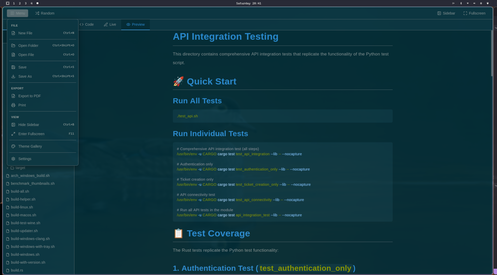

# 📝 Docura

**A fast, elegant, and powerful Markdown editor that surpasses Typora.**

🎉 **Version 1.0 Released!** 🎉

Docura is a next-generation native desktop app designed for Linux systems. Built with Rust (Tauri) and React, it combines the best features of Typora, VS Code, Medium, and Notion into one beautiful, lightweight application.

<div align="center">

[](LICENSE)
[](https://tauri.app)
[](https://reactjs.org)
[](https://www.rust-lang.org/)
[](https://github.com/WOF-Softwares/Docura/releases)

</div>

---

## 🎉 What's New in v1.1 (Day 2!)

**Day 2 brings a MASSIVE feature update!** Docura keeps getting better:

### 🆕 Day 2 Features (October 11, 2025)
- ✨ **Keyboard Shortcuts** - Ctrl+S (Save), Ctrl+Shift+S (Save As), Ctrl+O (Open), Ctrl+Shift+O (Open Folder)
- 🔔 **Toast Notifications** - Beautiful feedback for every action (save, open, errors)
- 🔴 **Unsaved Changes Indicator** - Pulsing dot shows when file needs saving
- 🎯 **Active File Highlighting** - Current file highlighted in sidebar with accent border
- 📁 **Single File Support** - Open files without folder now appear in sidebar
- 🖼️ **Image Loading** - Display local images in markdown with automatic path conversion
- ✅ **Interactive Checkboxes** - Click to toggle task lists in Preview/Live modes
- 🎨 **Theme-Aware Checkboxes** - Checkboxes match your current theme

### 📦 v1.0 Core Features
- ✅ **Three Editing Modes** - Code, Live (WYSIWYG), and Preview
- ✅ **12 Beautiful Themes** - Unified across entire application
- ✅ **PDF Export** - High-quality PDF generation with native save dialogs
- ✅ **Print Support** - PDF preview dialog with system print integration
- ✅ **Fullscreen Mode** - Distraction-free writing (F11)
- ✅ **Tiling WM Support** - Auto-detection for i3, sway, Hyprland, etc.
- ✅ **Document Outline** - Clickable navigation with smooth scrolling
- ✅ **96% Less Disk Space** - 12 MB vs Typora's 326 MB!
- ✅ **23% Less RAM** - 780 MB vs Typora's 1011 MB
- ✅ **94% Smaller Download** - 5 MB package vs 80 MB
- ✅ **100% Open Source** - Apache 2.0 license

**Getting better every day!** 🚀

### 🕰️ Docura's Evolution Timeline

**Built in less than 2 days, with continuous improvements!**

| Milestone | Time | Duration |
|-----------|------|----------|
| 🚀 **Started** | October 9, 10:12 PM | Day 0 |
| ⚙️ **Core features built** | Overnight | ~12 hours |
| 🎨 **Themes, toolbar, live preview** | October 10 | Day 1 |
| 📂 **File access, outline linking** | October 10, late | Day 1 |
| 🖨️ **Export, print, native dialogs** | October 11, morning | Day 2 |
| ✅ **v1.0 Released** | October 11, 11:29 AM | **37 hours!** |
| 🎉 **Day 2 Features** | October 11, evening | Day 2 |
| ⌨️ **Keyboard shortcuts, toasts** | October 11 | Day 2 |
| 🖼️ **Image loading, checkboxes** | October 11 | Day 2 |
| 🎯 **File indicators, highlights** | October 11 | Day 2 |

**From zero to feature-rich in 2 days!** ⚡  
*That's the power of Rust + Tauri + React + Amazing AI Tools!*

---

## 📸 Screenshots

<div align="center">

### Three Editing Modes

*Code, Live (WYSIWYG), and Preview modes in one powerful editor*

### 12 Beautiful Themes

*Unified theming across UI, editor, and preview*

### Document Outline Navigation

*Clickable headings with smooth scrolling*

### PDF Export & Print

*Native save dialogs and print preview*

**🌐 [View Live Demo →](https://wof-softwares.github.io/Docura/)**

</div>

---

## 🌟 Why Docura is Better Than Typora

| Feature | Typora | Docura | Winner |
|---------|--------|--------|--------|
| **Editing Modes** | 1 (Inline only) | 3 (Code + Live + Preview) | 🏆 **Docura** |
| **Split View** | ❌ No | ✅ Yes - See source + preview | 🏆 **Docura** |
| **Toolbar Buttons** | Limited | Full MS Word-style toolbar | 🏆 **Docura** |
| **Learning Curve** | Steep | Gentle - Visual + Educational | 🏆 **Docura** |
| **Markdown Visibility** | Hidden | Always visible when needed | 🏆 **Docura** |
| **Best for Beginners** | ❌ Confusing | ✅ Intuitive | 🏆 **Docura** |
| **Best for Pros** | ✅ Good | ✅ Better (more options) | 🏆 **Docura** |
| **Themes** | 6 | 12 (6 bases × light/dark) | 🏆 **Docura** |
| **Theme Consistency** | Partial | Full (UI + Editor + Preview) | 🏆 **Docura** |
| **Code Editor Theming** | Basic | Monaco with custom themes | 🏆 **Docura** |
| **Interactive Checkboxes** | ✅ Yes | ✅ Yes + Better UX | 🏆 **Docura** |
| **Outline Navigation** | ✅ Yes | ✅ Yes + Smooth scrolling | 🏆 **Docura** |
| **PDF Export** | ✅ Yes | ✅ Yes + Native dialogs | 🏆 **Tie** |
| **Print Preview** | ✅ Yes | ✅ Yes + PDF preview dialog | 🏆 **Docura** |
| **Fullscreen Mode** | ✅ Yes | ✅ Yes + Hides all UI | 🏆 **Docura** |
| **Tiling WM Support** | ❌ No | ✅ Auto-detection & titlebar hide | 🏆 **Docura** |
| **Disk Space** | ~326 MB | ~12 MB (96% less!) | 🏆 **Docura** |
| **Memory Usage** | ~1011 MB | ~780 MB (23% less!) | 🏆 **Docura** |
| **Download Size** | ~80 MB | ~5 MB (94% smaller) | 🏆 **Docura** |
| **Open Source** | ❌ No | ✅ Yes (Apache 2.0) | 🏆 **Docura** |
| **Price** | $14.99 | 🆓 Free | 🏆 **Docura** |

### 🎯 The Docura Advantage

**Three Editing Modes for Every User:**

1. **Code Mode** 📝
   - Raw markdown editing with Monaco editor
   - Syntax highlighting for 12 beautiful themes
   - Line numbers, code folding, and all IDE features
   - Perfect for power users who love markdown

2. **Live Mode** ✍️ (The Innovation!)
   - **WYSIWYG editing with split preview**
   - Type markdown on the left, see rendered output on the right
   - Toolbar buttons like MS Word (Bold, Italic, Headers, etc.)
   - Educational - learn markdown by seeing the connection
   - Perfect for beginners AND experts

3. **Preview Mode** 👁️
   - Read-only rendered markdown
   - Beautiful Typora-inspired typography
   - Interactive checkboxes that update the source
   - Clickable outline navigation with smooth scrolling

**Why This Approach is Revolutionary:**

- **Accessible** to MS Word users (toolbar buttons)
- **Powerful** for markdown experts (raw editing)
- **Educational** (see markdown source + rendered output simultaneously)
- **Flexible** (switch modes based on your workflow)

Typora forces you into one way of working. **Docura lets you choose your adventure!**

---

## ✨ Features

### 📝 Editing & Rendering
- 🎨 **Three Editing Modes** - Code, Live (WYSIWYG), and Preview
- 💻 **Monaco Editor** - The same editor as VS Code with full features
- ✍️ **WYSIWYG Editor** - Split-pane markdown editing with live preview
- 👁️ **Beautiful Preview** - Typora-inspired typography and layout
- ✅ **Interactive Checkboxes** - Click to toggle task lists in Preview/Live modes
- 🖼️ **Image Support** - Display local images with automatic path conversion
- 🔒 **Secure Image Loading** - Tauri asset protocol for safe file access
- 🎯 **Syntax Highlighting** - For code blocks in 12 custom themes

### 🎨 Theming System
- 🌈 **12 Beautiful Themes** - 6 base themes with light/dark variants
  - Dracula (Purple & Cyan)
  - Cappuccino (Warm Coffee Tones)
  - Nord (Arctic Cool Palette)
  - Solarized (Classic Precision)
  - Monokai (Vibrant Syntax)
  - GitHub (Professional Clean)
- 🎭 **Unified Theming** - Consistent colors across UI, Editor, and Preview
- 💾 **Theme Persistence** - Your choice is saved between sessions
- 🎲 **Random Theme** - Discover new themes with one click

### 📂 File Management
- 📁 **Folder Explorer** - Recursive directory tree with expand/collapse
- 📄 **Multiple File Support** - Quick switching between markdown files
- 💾 **Save & Save As** - Standard file operations with native dialogs
- 🔔 **Toast Notifications** - Visual feedback for all file operations
- 🔴 **Unsaved Changes** - Pulsing dot indicator when file needs saving
- 🎯 **Active File Highlight** - Current file highlighted with accent border
- 📋 **Single File Mode** - Files opened without folder show in sidebar
- 🔄 **Auto-sync** - Changes reflect across all editor modes

### 📄 Export & Print
- 📑 **PDF Export** - Convert markdown to beautiful PDFs with native save dialog
- 🖨️ **Print Support** - PDF preview dialog with print and download options
- 🎨 **Styled Output** - PDFs match your selected theme's styling
- 💾 **Native Dialogs** - System-native file save dialogs for seamless UX

### 🗺️ Navigation
- 📑 **Document Outline** - Automatic heading extraction (h1-h6)
- 🎯 **Click to Navigate** - Jump to any section with smooth scrolling
- 👁️ **Auto-Preview Switch** - Clicking outline switches to preview mode
- 🔍 **Visual Hierarchy** - Indented outline showing document structure

### 🪟 Window Management
- 🖥️ **Tiling WM Detection** - Auto-detects i3, sway, Hyprland, bspwm, etc.
- 🎬 **Fullscreen Mode** (F11) - Distraction-free writing
- 📐 **Sidebar Toggle** (Ctrl+B) - Show/hide file explorer
- 🎯 **Smart UI** - Hides toolbar and sidebar in fullscreen

### ⌨️ Keyboard Shortcuts
- **Ctrl+S** - Save current file
- **Ctrl+Shift+S** - Save As (with dialog)
- **Ctrl+O** - Open file
- **Ctrl+Shift+O** - Open folder
- **Ctrl+B** - Toggle sidebar visibility
- **F11** - Toggle fullscreen mode

*More shortcuts coming soon!*

### 🚀 Performance
- ⚡ **23% Less Memory** than Typora (780 MB vs 1011 MB)
- 🦀 **Rust Backend** - Native performance and safety
- 🌐 **System WebKit** - No bundled Chromium
- 📦 **Small Binary** - Efficient resource usage

### 🔒 Privacy & Security
- 🔐 **Offline-first** - All data stays on your machine
- 🚫 **No Telemetry** - Zero tracking or data collection
- 📍 **Local Storage** - Files never leave your computer
- 🔓 **Open Source** - Audit the code yourself

---

## 🧱 Tech Stack

| Layer       | Technology |
|-------------|------------|
| **Backend** | [Tauri 2.8](https://tauri.app) - Rust-based desktop framework |
| **Frontend** | React 19 + Vite 7 |
| **Code Editor** | [Monaco Editor](https://microsoft.github.io/monaco-editor/) (VS Code's editor) |
| **WYSIWYG Editor** | [@uiw/react-md-editor](https://github.com/uiwjs/react-md-editor) |
| **Markdown** | [react-markdown](https://github.com/remarkjs/react-markdown) with [remark-gfm](https://github.com/remarkjs/remark-gfm) |
| **Syntax Highlighting** | [Prism](https://prismjs.com/) via react-syntax-highlighter |
| **File I/O** | Tauri plugins (fs, dialog) |
| **Renderer** | WebKitGTK (system native) |
| **Styling** | Custom CSS with CSS variables + modern-normalize |

---

## 📊 Performance Comparison

Tested on Linux (Arch) with both applications:

| Metric | Typora (Electron) | Docura (Tauri) | Savings |
|--------|-------------------|----------------|---------|
| **Disk Space** | 326 MB | 12 MB | **-314 MB (96%)** ⚡ |
| **RAM Usage** | 1011 MB | 780 MB | **-231 MB (23%)** ⚡ |
| **Download Size** | 80 MB | 5 MB | **-75 MB (94%)** ⚡ |
| **Price** | $14.99 | $0.00 | **$14.99 saved** 💰 |

### 🎯 Key Takeaways
- **96% less disk space** - You could install **27 copies** of Docura in Typora's space!
- **23% less RAM** - 231 MB saved (enough to run another app!)
- **94% smaller download** - Faster to download and install
- **100% free** - Save $14.99 and get more features!

### Why is Docura more efficient?

- **WebKitGTK vs Chromium** - WebKit is significantly lighter
- **Rust vs Node.js** - More memory-efficient backend
- **System Integration** - Uses system WebKit rather than bundling everything
- **No V8 overhead** - Electron includes full V8 JavaScript engine for backend
- **Optimized Rendering** - Efficient React components with proper memoization

---

## 🚀 Getting Started

### Prerequisites

- **Node.js** (v18+)
- **Rust** (latest stable via [rustup](https://rustup.rs/))
- **System dependencies** (Linux):
  ```bash
  # Arch Linux
  sudo pacman -S webkit2gtk-4.1 base-devel
  
  # Ubuntu/Debian
  sudo apt install libwebkit2gtk-4.1-dev build-essential curl wget
  
  # Fedora
  sudo dnf install webkit2gtk4.1-devel gcc
  ```

### Quick Start Scripts

We provide convenient scripts for different workflows:

```bash
# Clone the repository
git clone https://github.com/WOF-Softwares/Docura.git
cd Docura

# Install dependencies
npm install

# Quick development start (recommended)
./dev.sh

# Or build + dev (if you want to test production build)
./build.sh

# Full production build
./build-prod.sh
```

### Manual Commands

```bash
# Development mode with hot-reload
npm run tauri:dev

# Build for production
npm run tauri:build

# Binary will be in src-tauri/target/release/
```

---

## 🎨 Theme Gallery

Docura includes 12 professionally designed themes:

### Dark Themes 🌙
- **Dracula Dark** - Purple and cyan accents with deep backgrounds
- **Cappuccino Dark** - Warm coffee-inspired tones
- **Nord Dark** - Cool arctic color palette
- **Solarized Dark** - Classic precision dark mode
- **Monokai Dark** - Vibrant high-contrast syntax
- **GitHub Dark** - Professional clean dark theme

### Light Themes ☀️
- **Dracula Light** - Bright variant with signature colors
- **Cappuccino Light** - Gentle warm beige tones
- **Nord Light** - Clean scandinavian aesthetic
- **Solarized Light** - Balanced light precision
- **Monokai Light** - Soft vibrant accents
- **GitHub Light** - Classic clean white theme

All themes are consistently applied across:
- Application UI (toolbar, sidebar, tabs)
- Monaco code editor with syntax highlighting
- WYSIWYG editor and toolbar
- Markdown preview with beautiful typography

---

## 🛣️ Roadmap

### ✅ Phase 1: Core Editor (Complete!)
- [x] Tauri + React project setup
- [x] Monaco Editor integration with custom themes
- [x] Three editing modes (Code, Live, Preview)
- [x] WYSIWYG markdown editor
- [x] File open/save dialogs
- [x] Modern UI layout with sidebar

### ✅ Phase 2: Features & Polish (Complete!)
- [x] 12 beautiful themes with full consistency
- [x] Folder tree sidebar with recursive browsing
- [x] Document outline with navigation
- [x] Interactive checkboxes in markdown
- [x] Fullscreen mode (F11)
- [x] Sidebar toggle (Ctrl+B)
- [x] Tiling window manager support
- [x] Theme persistence
- [x] Smooth scrolling navigation

### ✅ Phase 3: Export & Print (Complete!)
- [x] Export to PDF functionality with native dialogs
- [x] Print support with PDF preview dialog
- [x] Styled PDF output matching themes
- [x] Native file save integration

### 🚧 Phase 4: Enhanced Features (Next)
- [ ] Recent files list
- [ ] Search across files (Ctrl+F)
- [ ] Find & Replace (Ctrl+H)
- [ ] Auto-save option
- [ ] Custom CSS theme support
- [ ] Image paste from clipboard

### 🔮 Phase 5: Advanced Features
- [ ] Split pane editing (vertical/horizontal)
- [ ] Vim keybindings mode
- [ ] Diagram support (Mermaid, PlantUML)
- [ ] Table editor with visual interface
- [ ] Math equation editor (LaTeX)
- [ ] Export to HTML/Slides
- [ ] Git integration
- [ ] Plugin system for extensions

### 📦 Phase 6: Distribution
- [ ] AppImage packaging
- [ ] AUR package for Arch Linux
- [ ] `.deb` package for Debian/Ubuntu
- [ ] Flatpak support
- [x] **Version 1.0 Released!** 🎉

---

## 🤝 Contributing

We welcome contributions! Docura is built by the community, for the community.

### Areas Where You Can Help

- 🎨 **UI/UX improvements** - React components and styling
- 📝 **Markdown features** - Enhanced rendering and editing
- 🔧 **Rust backend** - File operations and system integration
- 🎯 **New features** - Implement items from the roadmap
- 🌍 **Internationalization** - Add translations
- 📚 **Documentation** - Improve guides and examples
- 🐛 **Bug fixes** - Report and fix issues
- 🧪 **Testing** - Write tests and test on different systems

### Development Workflow

1. Fork the repository
2. Create a feature branch: `git checkout -b feature/amazing-feature`
3. Make your changes and test thoroughly
4. Follow the existing code style
5. Commit with clear messages: `git commit -m 'Add amazing feature'`
6. Push to your fork: `git push origin feature/amazing-feature`
7. Open a Pull Request with a clear description

### Code Style

- **Rust**: Follow standard `rustfmt` formatting
- **JavaScript/React**: Use Prettier with default settings
- **CSS**: Use CSS variables for theming
- **Commits**: Use conventional commits format

---

## 📜 License

Apache 2.0 — see [LICENSE](LICENSE)

This means you can:
- ✅ Use commercially
- ✅ Modify
- ✅ Distribute
- ✅ Sublicense
- ✅ Use privately

---

## 🌐 Community & Support

- 💬 **Discussions** - [GitHub Discussions](https://github.com/WOF-Softwares/Docura/discussions)
- 🐛 **Issues** - [GitHub Issues](https://github.com/WOF-Softwares/Docura/issues)
- 🌟 **Star the repo** - If you find Docura useful!
- 🐦 **Share** - Spread the word about lightweight desktop apps
- 💰 **Sponsor** - Support development

---

## 🙏 Acknowledgments

### Inspiration & Tools
- Inspired by [Typora](https://typora.io/) - The excellent markdown editor (we made it better!)
- Built with [Tauri](https://tauri.app/) - The future of desktop applications
- Powered by [Monaco Editor](https://microsoft.github.io/monaco-editor/) - VSCode's editor
- Thanks to all [contributors](https://github.com/WOF-Softwares/Docura/graphs/contributors)

### 🤖 AI Tools That Made This Possible

This project was built with the incredible help of modern AI tools:

- **[Cursor](https://cursor.sh/)** - The AI-powered code editor that made development blazingly fast
- **[Claude AI](https://anthropic.com/) (Sonnet 3.5 & 4)** - For architecture, problem-solving, and smart suggestions
- **[GitHub Copilot](https://github.com/features/copilot)** - Real-time code completion and boilerplate generation
- **[Warp Terminal](https://www.warp.dev/)** - AI-powered terminal for efficient command execution
- **[DeepSeek](https://www.deepseek.com/)** - Helped craft the beautiful landing page HTML/CSS
- **[Bing Copilot](https://www.bing.com/chat)** - Research, documentation, and best practices guidelines

**Special Thanks to Claude (Anthropic)** 🎉 - The primary AI model powering most of the development, architecture decisions, and problem-solving throughout this project. Claude's ability to understand context, suggest elegant solutions, and help debug issues was instrumental in completing Docura in just 2 days!

*This project showcases what's possible when human creativity meets AI assistance. The future of software development is here!*

---

## 🎯 Project Goals

1. **Better than Typora** - More features, better UX, open source
2. **Accessible to Everyone** - From beginners to markdown experts
3. **Performance First** - Native speed with minimal resource usage
4. **Beautiful by Default** - No configuration needed for great looks
5. **Privacy Focused** - Your data stays on your machine
6. **Community Driven** - Built with and for the community

---

<div align="center">

**Made with ❤️ by the Docura community**

---

### 🎊 Celebrating v1.0! 🎊

**From zero to a fully-featured markdown editor in just 37 hours!**

🌟 **Three editing modes** for every user level  
🎨 **12 gorgeous themes** that stay consistent  
📑 **PDF export & print** with beautiful output  
⚡ **23% lighter** than the competition  
⏱️ **Built in <2 days** - October 9-11, 2025  
🔓 **100% free** and open source  

**Thanks to everyone who believed in this project!** 🙏

---

[⭐ Star us on GitHub](https://github.com/WOF-Softwares/Docura) | [🐛 Report Bug](https://github.com/WOF-Softwares/Docura/issues) | [💡 Request Feature](https://github.com/WOF-Softwares/Docura/issues)

</div>
