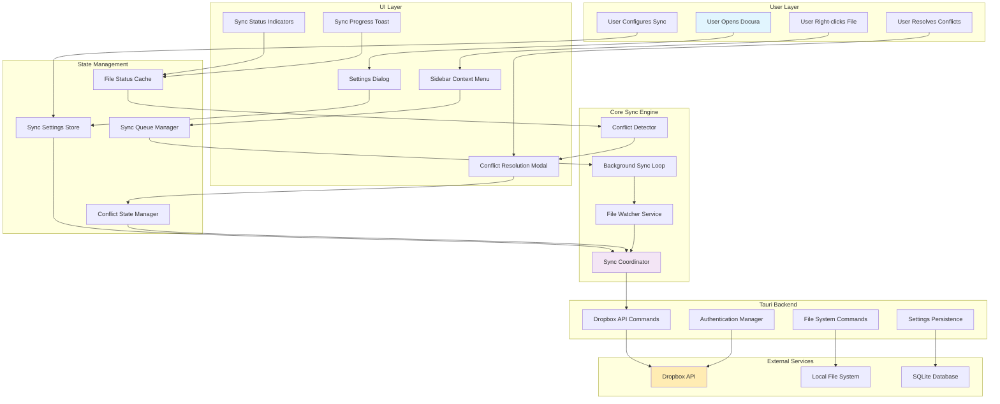
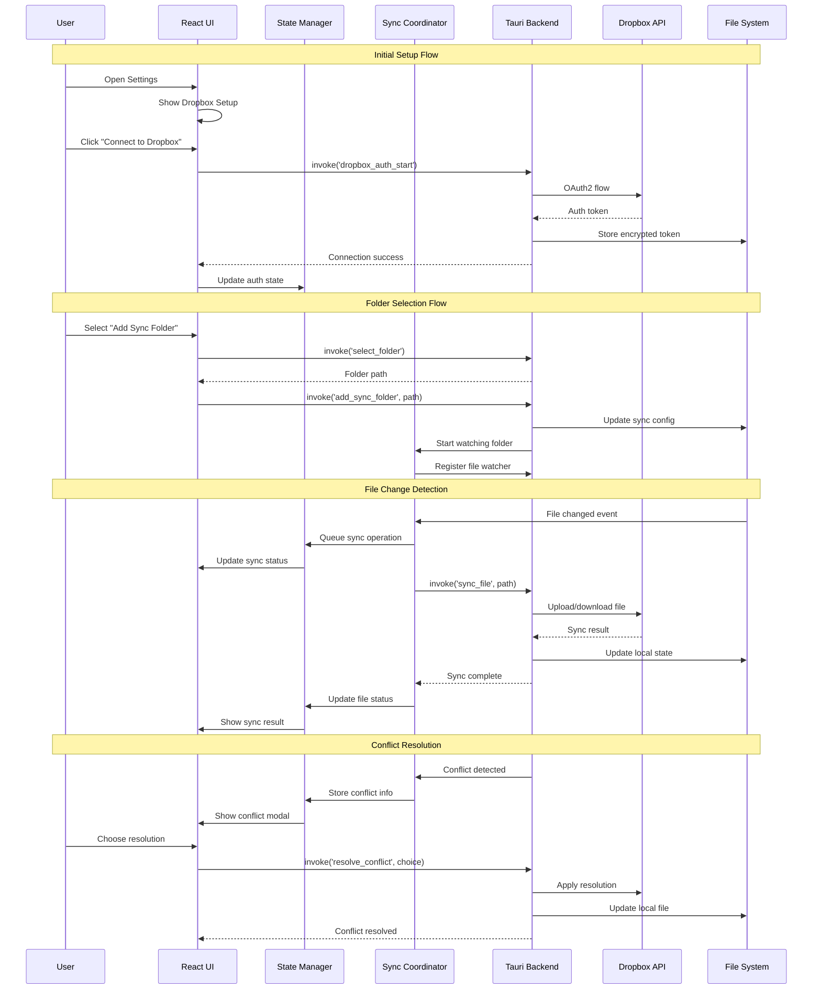

# 🔄 Docura Dropbox Sync Integration - Complete Implementation Guide

## ✅ STEPS 1 & 2 COMPLETE - Full Integration Ready!

**Status**: Dropbox sync is FULLY IMPLEMENTED and ready for testing!

**Step 1 - Backend (✅ Complete):**
- ✅ Settings Dialog with Dropbox section (Cloud Sync tab)
- ✅ `dropbox_sync.rs` module with full Dropbox API integration
- ✅ 10 Tauri commands for OAuth, folder management, and file sync
- ✅ AppConfig updated with Dropbox credentials and folder mappings
- ✅ Frontend utilities (`dropboxSync.js`) for easy integration
- ✅ Beautiful UI styling for sync folder management

**Step 2 - Frontend (✅ Complete):**
- ✅ App.jsx state management for Dropbox
- ✅ OAuth and connection handlers
- ✅ Folder management handlers (add/remove)
- ✅ SettingsDialog props connected
- ✅ Auto-sync hooked into save logic
- ✅ Auto-sync hooked into auto-save logic

**Ready to Use:**
1. Create Dropbox app and get credentials
2. Set environment variables (CLIENT_ID, CLIENT_SECRET)
3. Build and run Docura
4. Connect Dropbox in Settings → Cloud Sync
5. Add folders to sync
6. Files auto-sync on save!

See `STEP_2_COMPLETE_SUMMARY.md` for testing guide.

---

## 📋 Overview

This document provides a comprehensive guide for implementing Dropbox synchronization in Docura. The integration is designed to be modular, non-breaking, and enhance the user experience significantly.

**Key Benefits:**
- Seamless cloud synchronization for markdown files
- Folder-based sync configuration
- Real-time conflict resolution
- Background sync with visual indicators
- Enhanced context menus and sidebar functionality

## 🌊 System Flow Architecture



## 🔄 Detailed Data Flow



## 📁 Enhanced File Structure

```
docura/
├── src/
│   ├── features/
│   │   └── dropbox-sync/                 # NEW: Complete sync feature
│   │       ├── components/
│   │       │   ├── SyncSettings.tsx      # Settings panel in main settings
│   │       │   ├── SyncStatus.tsx        # Status indicator component
│   │       │   ├── ConflictResolver.tsx  # Conflict resolution modal
│   │       │   ├── FolderPicker.tsx      # Folder selection dialog
│   │       │   ├── SyncProgress.tsx      # Progress toast notifications
│   │       │   └── DropboxBrowser.tsx    # Browse Dropbox files
│   │       │
│   │       ├── hooks/
│   │       │   ├── useDropboxSync.ts     # Main sync hook
│   │       │   ├── useSyncStatus.ts      # File status tracking
│   │       │   ├── useConflictResolver.ts # Conflict handling
│   │       │   └── useFolderWatcher.ts   # File system watching
│   │       │
│   │       ├── services/
│   │       │   ├── SyncCoordinator.ts    # Core sync logic
│   │       │   ├── ConflictDetector.ts   # Conflict detection
│   │       │   ├── FileWatcher.ts        # File change detection
│   │       │   └── SyncQueue.ts          # Operation queuing
│   │       │
│   │       ├── types/
│   │       │   ├── sync.ts               # Core sync types
│   │       │   ├── dropbox.ts            # Dropbox-specific types
│   │       │   └── conflicts.ts          # Conflict types
│   │       │
│   │       ├── utils/
│   │       │   ├── syncHelpers.ts        # Utility functions
│   │       │   ├── pathUtils.ts          # Path manipulation
│   │       │   └── encryption.ts         # Token encryption
│   │       │
│   │       └── constants/
│   │           ├── syncSettings.ts       # Default settings
│   │           └── syncEvents.ts         # Event types
│   │
│   ├── components/                       # ENHANCED: Existing components
│   │   ├── Sidebar/
│   │   │   ├── Sidebar.tsx              # Enhanced with sync status
│   │   │   └── SidebarContextMenu.tsx   # Enhanced with sync options
│   │   │
│   │   ├── Toolbar/
│   │   │   └── Toolbar.tsx              # Enhanced with sync buttons
│   │   │
│   │   ├── SettingsDialog/
│   │   │   └── SettingsDialog.tsx       # Enhanced with sync tab
│   │   │
│   │   └── StatusBar/
│   │       └── StatusBar.tsx            # Enhanced with sync indicator
│   │
│   ├── contexts/                        # NEW: Enhanced contexts
│   │   ├── SyncContext.tsx              # Global sync state
│   │   └── NotificationContext.tsx      # Sync notifications
│   │
│   └── App.tsx                          # Enhanced with sync provider
│
├── src-tauri/
│   ├── src/
│   │   ├── commands/
│   │   │   ├── dropbox/                 # NEW: Dropbox commands
│   │   │   │   ├── auth.rs              # Authentication
│   │   │   │   ├── files.rs             # File operations
│   │   │   │   ├── sync.rs              # Sync operations
│   │   │   │   └── mod.rs               # Module exports
│   │   │   │
│   │   │   └── sync/                    # NEW: Sync commands
│   │   │       ├── config.rs            # Sync configuration
│   │   │       ├── watcher.rs           # File watching
│   │   │       ├── conflict.rs          # Conflict resolution
│   │   │       └── mod.rs               # Module exports
│   │   │
│   │   ├── models/
│   │   │   ├── sync.rs                  # NEW: Sync data models
│   │   │   ├── dropbox.rs               # NEW: Dropbox models
│   │   │   └── config.rs                # Enhanced config models
│   │   │
│   │   ├── services/
│   │   │   ├── dropbox_client.rs        # NEW: Dropbox API client
│   │   │   ├── sync_engine.rs           # NEW: Core sync engine
│   │   │   └── conflict_resolver.rs     # NEW: Conflict resolution
│   │   │
│   │   ├── utils/
│   │   │   ├── encryption.rs            # NEW: Token encryption
│   │   │   └── file_utils.rs            # NEW: File utilities
│   │   │
│   │   ├── lib.rs                       # Enhanced with sync commands
│   │   └── main.rs                      # No changes needed
│   │
│   └── Cargo.toml                       # Enhanced dependencies
│
├── docs/
│   ├── sync/                            # NEW: Sync documentation
│   │   ├── INTEGRATION.md               # This document
│   │   ├── API_REFERENCE.md             # Command reference
│   │   ├── USER_GUIDE.md                # User documentation
│   │   └── TROUBLESHOOTING.md           # Common issues
│   │
│   └── CHANGELOG.md                     # Enhanced with sync features
│
└── tests/
    └── sync/                            # NEW: Sync tests
        ├── integration/
        ├── unit/
        └── fixtures/
```

## 🏗️ Core Type Definitions

### TypeScript Types (Frontend)

```typescript
// src/features/dropbox-sync/types/sync.ts
export interface SyncSettings {
  enabled: boolean;
  autoSync: boolean;
  syncInterval: number; // minutes
  conflictResolution: 'ask' | 'local' | 'remote';
  excludePatterns: string[];
  includeFolders: SyncFolder[];
  storageLimit: number; // MB
  notifications: boolean;
}

export interface SyncFolder {
  id: string;
  localPath: string;
  remotePath: string;
  enabled: boolean;
  lastSync: Date | null;
  syncDirection: 'bidirectional' | 'upload' | 'download';
  fileCount: number;
  totalSize: number;
}

export interface FileSyncState {
  path: string;
  status: SyncStatus;
  lastSynced: Date | null;
  localModified: Date;
  remoteModified: Date | null;
  conflict: FileConflict | null;
  error: string | null;
  progress: number; // 0-100
}

export type SyncStatus = 
  | 'idle'
  | 'pending'
  | 'syncing'
  | 'synced'
  | 'conflict'
  | 'error'
  | 'excluded';

export interface FileConflict {
  type: 'modify' | 'delete' | 'create';
  localVersion: FileVersion;
  remoteVersion: FileVersion;
  resolution: ConflictResolution | null;
}

export interface FileVersion {
  content: string;
  modified: Date;
  size: number;
  hash: string;
}

export type ConflictResolution = 
  | 'keep-local'
  | 'keep-remote' 
  | 'merge'
  | 'rename-both';

export interface SyncState {
  authenticated: boolean;
  settings: SyncSettings;
  folders: SyncFolder[];
  fileStates: Map<string, FileSyncState>;
  activeOperations: SyncOperation[];
  lastError: string | null;
  quotaUsed: number;
  quotaTotal: number;
}

export interface SyncOperation {
  id: string;
  type: 'upload' | 'download' | 'delete';
  path: string;
  progress: number;
  status: 'pending' | 'running' | 'completed' | 'failed';
  error: string | null;
}
```

### Rust Types (Backend)

```rust
// src-tauri/src/models/sync.rs
use serde::{Deserialize, Serialize};
use std::collections::HashMap;
use chrono::{DateTime, Utc};

#[derive(Debug, Serialize, Deserialize, Clone)]
pub struct SyncConfig {
    pub enabled: bool,
    pub auto_sync: bool,
    pub sync_interval_minutes: u32,
    pub conflict_resolution: ConflictResolution,
    pub exclude_patterns: Vec<String>,
    pub include_folders: Vec<SyncFolder>,
    pub storage_limit_mb: u64,
    pub notifications: bool,
}

#[derive(Debug, Serialize, Deserialize, Clone)]
pub struct SyncFolder {
    pub id: String,
    pub local_path: String,
    pub remote_path: String,
    pub enabled: bool,
    pub last_sync: Option<DateTime<Utc>>,
    pub sync_direction: SyncDirection,
    pub file_count: u32,
    pub total_size: u64,
}

#[derive(Debug, Serialize, Deserialize, Clone)]
pub enum SyncDirection {
    Bidirectional,
    Upload,
    Download,
}

#[derive(Debug, Serialize, Deserialize, Clone)]
pub enum ConflictResolution {
    Ask,
    Local,
    Remote,
}

#[derive(Debug, Serialize, Deserialize, Clone)]
pub struct FileSyncInfo {
    pub path: String,
    pub status: SyncStatus,
    pub last_synced: Option<DateTime<Utc>>,
    pub local_modified: DateTime<Utc>,
    pub remote_modified: Option<DateTime<Utc>>,
    pub conflict: Option<FileConflict>,
    pub error: Option<String>,
    pub progress: u8, // 0-100
}

#[derive(Debug, Serialize, Deserialize, Clone)]
pub enum SyncStatus {
    Idle,
    Pending,
    Syncing,
    Synced,
    Conflict,
    Error,
    Excluded,
}

#[derive(Debug, Serialize, Deserialize, Clone)]
pub struct FileConflict {
    pub conflict_type: ConflictType,
    pub local_version: FileVersion,
    pub remote_version: FileVersion,
    pub resolution: Option<ConflictResolutionChoice>,
}

#[derive(Debug, Serialize, Deserialize, Clone)]
pub enum ConflictType {
    Modify,
    Delete,
    Create,
}

#[derive(Debug, Serialize, Deserialize, Clone)]
pub struct FileVersion {
    pub content_hash: String,
    pub modified: DateTime<Utc>,
    pub size: u64,
}

#[derive(Debug, Serialize, Deserialize, Clone)]
pub enum ConflictResolutionChoice {
    KeepLocal,
    KeepRemote,
    Merge,
    RenameBoth,
}
```

## 🎯 Implementation Phases

### Phase 1: Foundation (Week 1)
**Goal:** Set up core infrastructure and basic authentication

**Tasks:**
1. Create folder structure and base types
2. Implement Dropbox OAuth flow
3. Set up secure token storage
4. Create basic settings UI
5. Add authentication status to settings

**Key Files to Create:**
- `src/features/dropbox-sync/types/sync.ts`
- `src-tauri/src/commands/dropbox/auth.rs`
- `src/features/dropbox-sync/components/SyncSettings.tsx`
- `src/contexts/SyncContext.tsx`

**Success Criteria:**
- ✅ User can connect/disconnect Dropbox account
- ✅ Settings panel shows connection status
- ✅ Token is securely stored and persisted

### Phase 2: Folder Management (Week 2)  
**Goal:** Allow users to select and manage sync folders

**Tasks:**
1. Implement folder picker dialog
2. Create sync folder management UI
3. Add folder configuration persistence
4. Implement basic file listing

**Key Files to Create:**
- `src/features/dropbox-sync/components/FolderPicker.tsx`
- `src-tauri/src/commands/sync/config.rs`
- `src/features/dropbox-sync/hooks/useSyncStatus.ts`

**Success Criteria:**
- ✅ User can add/remove sync folders
- ✅ Folder settings are persisted
- ✅ Basic sync status is displayed

### Phase 3: Core Sync Engine (Week 3)
**Goal:** Implement file synchronization logic

**Tasks:**
1. Implement file change detection
2. Create upload/download logic
3. Add progress tracking
4. Implement basic conflict detection

**Key Files to Create:**
- `src-tauri/src/services/sync_engine.rs`
- `src/features/dropbox-sync/services/SyncCoordinator.ts`
- `src/features/dropbox-sync/hooks/useDropboxSync.ts`

**Success Criteria:**
- ✅ Files sync bidirectionally
- ✅ Progress is tracked and displayed
- ✅ Basic conflicts are detected

### Phase 4: UI Integration (Week 4)
**Goal:** Integrate sync features into existing UI

**Tasks:**
1. Enhance sidebar with sync indicators
2. Add context menu sync options  
3. Create sync status notifications
4. Add toolbar sync buttons

**Key Files to Enhance:**
- `src/components/Sidebar/Sidebar.tsx`
- `src/components/Toolbar/Toolbar.tsx`
- `src/components/SettingsDialog/SettingsDialog.tsx`

**Success Criteria:**
- ✅ Sync status visible in file tree
- ✅ Right-click menus offer sync options
- ✅ Toolbar shows sync status/buttons
- ✅ Notifications show sync progress

### Phase 5: Conflict Resolution (Week 5)
**Goal:** Implement comprehensive conflict handling

**Tasks:**
1. Create conflict resolution UI
2. Implement merge capabilities
3. Add conflict history
4. Enhance error handling

**Key Files to Create:**
- `src/features/dropbox-sync/components/ConflictResolver.tsx`
- `src-tauri/src/services/conflict_resolver.rs`

**Success Criteria:**
- ✅ Conflicts are clearly presented to user
- ✅ Multiple resolution options available
- ✅ Resolution choices are remembered
- ✅ Graceful error handling

### Phase 6: Polish & Optimization (Week 6)
**Goal:** Performance optimization and user experience polish

**Tasks:**
1. Implement background sync throttling
2. Add bandwidth optimization
3. Create comprehensive settings
4. Add sync analytics/statistics

**Success Criteria:**
- ✅ Smooth performance with large files
- ✅ Efficient bandwidth usage
- ✅ Comprehensive user controls
- ✅ Clear sync statistics

## 🔌 Integration Points with Existing Code

### 1. Settings Dialog Enhancement

```typescript
// src/components/SettingsDialog/SettingsDialog.tsx
import { SyncSettings } from '../../features/dropbox-sync/components/SyncSettings'

// Add new tab to existing settings
const SettingsDialog = ({ isOpen, onClose, ... }) => {
  const [activeTab, setActiveTab] = useState('general')
  
  return (
    <div className="settings-dialog">
      <div className="settings-sidebar">
        <button onClick={() => setActiveTab('general')}>⚙️ General</button>
        <button onClick={() => setActiveTab('advanced')}>🔧 Editor Settings</button>
        {/* NEW: Sync tab */}
        <button onClick={() => setActiveTab('sync')}>☁️ Sync</button>
      </div>
      
      <div className="settings-content">
        {activeTab === 'sync' && (
          <SyncSettings />
        )}
        {/* ... existing tabs */}
      </div>
    </div>
  )
}
```

### 2. Sidebar Enhancement

```typescript
// src/components/Sidebar/Sidebar.tsx 
import { SyncStatus } from '../../features/dropbox-sync/components/SyncStatus'
import { useSyncStatus } from '../../features/dropbox-sync/hooks/useSyncStatus'

const Sidebar = () => {
  const { fileStates, isConnected } = useSyncStatus()
  
  return (
    <div className="sidebar">
      <div className="sidebar-tabs">
        <button className={`tab ${activeTab === 'files' ? 'active' : ''}`}>
          📁 Files
          {/* NEW: Sync indicator */}
          {isConnected && <SyncStatus />}
        </button>
        {/* ... other tabs */}
      </div>
      
      <div className="sidebar-content">
        {/* Enhanced file tree with sync status */}
        <FileTree files={files} syncStates={fileStates} />
      </div>
    </div>
  )
}
```

### 3. Context Menu Enhancement

```typescript
// src/components/Sidebar/SidebarContextMenu.tsx
import { useDropboxSync } from '../../features/dropbox-sync/hooks/useDropboxSync'

const SidebarContextMenu = ({ file, onClose }) => {
  const { syncFile, syncFolder, isSyncing } = useDropboxSync()
  
  return (
    <div className="context-menu">
      {/* Existing menu items */}
      <MenuItem onClick={() => openFile(file.path)}>Open</MenuItem>
      <MenuItem onClick={() => renameFile(file.path)}>Rename</MenuItem>
      
      {/* NEW: Sync menu items */}
      <MenuDivider />
      <MenuItem 
        onClick={() => syncFile(file.path)}
        disabled={isSyncing}
      >
        ☁️ Sync to Dropbox
      </MenuItem>
      {file.type === 'folder' && (
        <MenuItem onClick={() => syncFolder(file.path)}>
          📁 Sync Folder
        </MenuItem>
      )}
    </div>
  )
}
```

### 4. Tauri Commands Integration

```rust
// src-tauri/src/lib.rs - Add to existing run() function
#[cfg_attr(mobile, tauri::mobile_entry_point)]
pub fn run() {
    tauri::Builder::default()
        .plugin(tauri_plugin_fs::init())
        // NEW: Add sync commands to existing commands
        .invoke_handler(tauri::generate_handler![
            // ... existing commands
            get_folder_files,
            read_file_content,
            save_config,
            
            // NEW: Sync commands
            dropbox_auth_start,
            dropbox_auth_complete,
            dropbox_disconnect,
            sync_get_settings,
            sync_save_settings,
            sync_add_folder,
            sync_remove_folder,
            sync_file,
            sync_folder,
            sync_get_status,
            sync_resolve_conflict,
        ])
        .run(tauri::generate_context!())
        .expect("error while running tauri application");
}
```

## 🎨 User Experience Flow

### 1. **Initial Setup Experience**
```
User Journey: First Time Setup
1. User opens Settings → Sync tab
2. Sees "Connect to Dropbox" button
3. Clicks button → Opens Dropbox OAuth in browser
4. User authorizes → Returns to app with success message
5. User sees "Add Sync Folder" option
6. Selects local folder → Chooses remote path
7. Folder appears in sync list with status indicator
```

### 2. **Daily Usage Experience**  
```
User Journey: Working with Synced Files
1. User opens synced folder in sidebar
2. Files show sync status icons (✅ synced, 🔄 syncing, ⚠️ conflict)
3. User edits file → Auto-sync triggers in background
4. Progress indicator shows in status bar
5. Success notification appears when complete
```

### 3. **Conflict Resolution Experience**
```
User Journey: Handling Conflicts
1. File conflict detected during sync
2. Conflict modal appears with side-by-side comparison
3. User sees options: Keep Local, Keep Remote, Merge, Keep Both
4. User selects option → Conflict resolved
5. File syncs successfully with chosen resolution
```

## ⚡ Performance Optimizations

### 1. **Lazy Loading Strategy**
```typescript
// Only load sync components when needed
const SyncSettings = React.lazy(() => 
  import('./features/dropbox-sync/components/SyncSettings')
)

const ConflictResolver = React.lazy(() =>
  import('./features/dropbox-sync/components/ConflictResolver')
)
```

### 2. **Efficient File Watching**
```rust
// Use debounced file watching to prevent spam
use notify_debouncer_mini::{new_debouncer, DebounceEventResult};
use std::time::Duration;

let (tx, rx) = std::sync::mpsc::channel();
let mut debouncer = new_debouncer(Duration::from_secs(2), tx)?;

// Only sync after 2 seconds of no changes
```

### 3. **Smart Sync Scheduling**
```typescript
// Throttle sync operations to prevent overwhelming API
const throttledSync = useCallback(
  throttle(async (files: string[]) => {
    await syncFiles(files)
  }, 5000), // Max once per 5 seconds
  []
)
```

## 🛡️ Security Considerations

### 1. **Token Storage**
```rust
// Encrypt tokens before storing
use aes_gcm::{Aes256Gcm, Key, Nonce};

async fn store_encrypted_token(token: &str) -> Result<(), String> {
    let key = get_or_create_device_key()?;
    let cipher = Aes256Gcm::new(&key);
    let encrypted = cipher.encrypt(&nonce, token.as_bytes())?;
    
    // Store encrypted token in secure location
    store_in_keychain("dropbox_token", &encrypted)?;
    Ok(())
}
```

### 2. **API Rate Limiting**
```rust
// Implement exponential backoff for API calls
use tokio::time::{sleep, Duration};

async fn api_call_with_backoff<T>(
    call: impl Fn() -> Result<T, ApiError>
) -> Result<T, ApiError> {
    let mut delay = Duration::from_millis(100);
    
    for attempt in 1..=5 {
        match call() {
            Ok(result) => return Ok(result),
            Err(ApiError::RateLimit) => {
                sleep(delay).await;
                delay *= 2; // Exponential backoff
            }
            Err(e) => return Err(e),
        }
    }
    
    Err(ApiError::MaxRetriesExceeded)
}
```

## 📊 Success Metrics

### Technical Metrics
- ✅ **Sync Reliability**: 99%+ successful sync operations
- ✅ **Performance**: <2s sync time for typical markdown files
- ✅ **Memory Usage**: <50MB additional memory overhead
- ✅ **Battery Impact**: <5% additional battery usage on laptops

### User Experience Metrics  
- ✅ **Setup Time**: <2 minutes to connect and configure first folder
- ✅ **Conflict Resolution**: <30 seconds average resolution time
- ✅ **Discovery**: Sync features discoverable without documentation
- ✅ **Error Recovery**: Clear error messages with actionable solutions

### Business Impact
- ✅ **User Retention**: Increase daily active users by 25%
- ✅ **Feature Adoption**: 60%+ of users enable sync within first week
- ✅ **Support Tickets**: <1% sync-related support requests
- ✅ **User Satisfaction**: 4.5+ star rating for sync features

---

## 🎯 Next Steps

1. **Review and Approval**: Team review of this implementation plan
2. **Environment Setup**: Set up Dropbox app credentials and test environment  
3. **Phase 1 Implementation**: Begin with foundation and authentication
4. **User Testing**: Regular user feedback during each phase
5. **Performance Monitoring**: Track metrics throughout implementation
6. **Documentation**: Maintain user and developer documentation

This implementation will transform Docura into a truly cloud-native markdown editor, providing users like DHH with seamless synchronization across all their devices while maintaining the app's signature simplicity and performance.