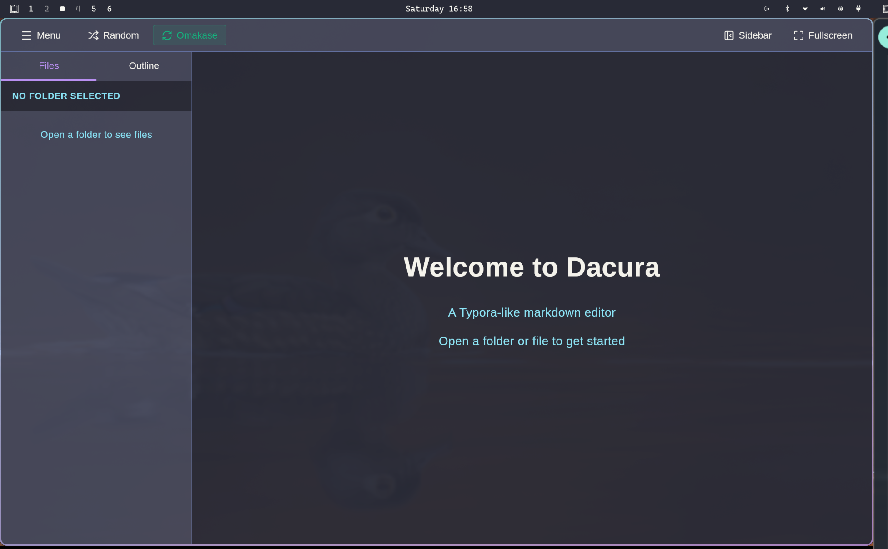

# 🖼️ Image Handling in Docura

Docura seamlessly handles both **local file system images** and **online internet images** in your markdown documents.

## 📋 Overview

Docura's image handling system automatically detects and processes images based on their source:

- 🌐 **Online Images** → Loaded directly from the web (no conversion)
- 📁 **Local Images** → Converted to Tauri's secure `asset://` protocol

## ✅ Supported Image Types

### Online Images (Internet URLs)

These are loaded directly without modification:

```markdown
# Standard HTTP/HTTPS URLs


# Protocol-relative URLs


# FTP URLs


# Data URIs (Base64)


# Blob URLs

```

### Local Images (File System)

These are automatically converted to the secure `asset://` protocol:

```markdown
# Relative paths



# Absolute paths


# Parent directory references

```

## 🔧 How It Works

### 1. URL Detection

The system uses the `isExternalUrl()` function to detect URLs:

```javascript
// Detects these patterns:
- http://
- https://
- ftp://
- ftps://
- //example.com (protocol-relative)
- data:
- asset:
- blob:
```

### 2. Local Path Conversion

For local paths:
1. Resolves relative paths based on current file location
2. Converts to absolute paths
3. Wraps in Tauri's `asset://` protocol for secure access

### 3. Security

- **Local files**: Protected by Tauri's asset protocol with scoped permissions
- **Online images**: Loaded directly by the browser (CSP allows all)
- **No telemetry**: Images are never sent to external servers

## 📝 Usage Examples

### GitHub README Example

Perfect for viewing GitHub READMEs locally:

```markdown
# My Project

<!-- Online badge -->


<!-- Local screenshot -->


<!-- Mix both! -->
Features:
- 🌠
- 📸 Local preview: 
```

### Documentation with Assets

```markdown
# User Guide

## Installation

Download the latest release:


See the installation steps:


```

### HTML Image Tags

Both markdown and HTML syntax work:

```markdown
<!-- Markdown syntax -->


<!-- HTML syntax -->


<!-- Both work for local files too -->


```

## 🐛 Debugging

Open the browser console (F12 > Console) to see image processing logs:

```
🌐 Keeping external URL: https://example.com/image.png...
✅ Converted local image: ./assets/logo.png → asset://
⚠️ Failed to convert image path: ./missing.png
```

### Log Messages Explained:

- 🌐 **Blue**: External URL kept unchanged
- ✅ **Green**: Local path converted successfully
- ⚠️ **Yellow**: Conversion failed (file might not exist)
- ❌ **Red**: Critical error in image processing

## 🔍 Technical Details

### File Permissions

Local images must be within allowed scopes (configured in `tauri.conf.json`):

```json
{
  "assetProtocol": {
    "enable": true,
    "scope": [
      "$HOME/**",
      "$DOCUMENT/**",
      "$DOWNLOAD/**",
      "$PICTURE/**",
      "$DESKTOP/**"
    ]
  }
}
```

### Content Security Policy

CSP is set to `null` to allow loading images from any source:

```json
{
  "security": {
    "csp": null
  }
}
```

### Image Paste Feature

When you paste images from clipboard (Ctrl+V):
1. Image is saved to `assets/` folder next to your markdown file
2. Markdown syntax is inserted: ``
3. Path is automatically converted to `asset://` protocol

## 💡 Best Practices

### For Online Images

✅ **DO:**
- Use HTTPS URLs for security
- Use CDN-hosted images for reliability
- Include alt text for accessibility

❌ **DON'T:**
- Use HTTP for sensitive images
- Rely on images from unreliable sources
- Use extremely large images (bandwidth)

### For Local Images

✅ **DO:**
- Keep images in `assets/` or `images/` folder
- Use relative paths (portable across systems)
- Optimize image sizes

❌ **DON'T:**
- Use absolute paths (not portable)
- Store large images in repository
- Reference system directories outside allowed scopes

## 🚀 Advanced Usage

### Mixing Local and Online

```markdown
# Project Status

<!-- Online: CI/CD badges -->


<!-- Local: Screenshots -->


<!-- Online: Logo from website -->


<!-- Local: Architecture diagram -->

```

### Image Galleries

```markdown
## Gallery

<div style="display: grid; grid-template-columns: repeat(3, 1fr); gap: 10px;">
  
  
  
  
  
  
</div>
```

## 📊 Performance

### Online Images
- ⚡ Fast: Loaded directly by browser
- 🌐 Cached: Browser handles caching
- 📡 Network: Requires internet connection

### Local Images
- 🚀 Instant: No network latency
- 💾 Direct: Read from file system
- 🔒 Secure: Tauri asset protocol protection

## 🔐 Security

### Threat Protection

- **Path Traversal**: Prevented by Tauri's scope system
- **XSS**: Images are loaded, not executed
- **Privacy**: Local images never leave your machine
- **CORS**: Not applicable to local images

## 📚 API Reference

### `isExternalUrl(path: string): boolean`

Check if a path is an external URL.

```javascript
import { isExternalUrl } from './utils/imagePathConverter'

isExternalUrl('https://example.com/image.png')  // true
isExternalUrl('./local/image.png')               // false
isExternalUrl('//example.com/image.png')         // true
isExternalUrl('data:image/png;base64,...')       // true
```

### `convertMarkdownImagePaths(markdown: string, filePath: string): Promise<string>`

Convert all local image paths in markdown to asset:// protocol.

```javascript
import { convertMarkdownImagePaths } from './utils/imagePathConverter'

const markdown = ' '
const converted = await convertMarkdownImagePaths(markdown, '/path/to/file.md')
// Result: ' '
```

### `convertToAssetUrl(filePath: string, basePath?: string): Promise<string>`

Convert a single file path to asset:// protocol.

```javascript
import { convertToAssetUrl } from './utils/imagePathConverter'

await convertToAssetUrl('./image.png', '/path/to/file.md')
// Result: 'asset://localhost/path/to/image.png'

await convertToAssetUrl('https://example.com/image.png')
// Result: 'https://example.com/image.png' (unchanged)
```

## ✅ Testing

Use the included test file:

1. Open `test-images-mixed.md` in Docura
2. Check that online badges/images load
3. Check that local screenshots/logos convert
4. Verify console logs show correct processing

## 🆘 Troubleshooting

### Online Images Not Loading

**Problem**: Online images appear broken

**Solutions**:
- Check internet connection
- Verify URL is accessible in browser
- Check if URL returns proper image content-type

### Local Images Not Loading

**Problem**: Local images show broken icon

**Solutions**:
- Verify file exists at specified path
- Check file is in allowed scope (`$HOME`, `$DOCUMENT`, etc.)
- Ensure relative path is correct relative to markdown file
- Check console for conversion errors

### Mixed Content Issues

**Problem**: Some images load, others don't

**Solutions**:
- Check console logs to see which URLs are being processed
- Verify both local paths and URLs are correct
- Test each image type separately

## 🎉 Summary

Docura provides intelligent image handling that:

✅ Automatically detects online vs local images  
✅ Converts local paths to secure asset:// protocol  
✅ Leaves online URLs unchanged for direct loading  
✅ Supports all standard markdown and HTML image syntax  
✅ Provides detailed console logging for debugging  
✅ Handles edge cases (protocol-relative URLs, data URIs, etc.)  

**Result**: Seamless image experience for both local and online content! 🚀

